# 🚀 BleLink - Bluetooth LE App

An Android app built with **Jetpack Compose**, **Kotlin** that enables Bluetooth Low Energy (BLE) communication.
The app allows users to **scan for BLE devices**, **connect**, **explore services, characteristics, and descriptors**, and **perform read/write operations**.

## 🛠 Features
- 🔍 Scan for nearby Bluetooth LE devices
- 🔗 Connect and disconnect from BLE devices
- 📜 Discover services, characteristics, and descriptors
- 📡 Read and write data from BLE characteristics
- 🔄 Subscribe to characteristic notifications and indications
- 🔒 Uses Google Accompanist for runtime permissions
- 🏗 Modular architecture with Hilt for Dependency Injection
- 📱 Modern UI with Jetpack Compose


## 📦 Tech Stack
- **Language:** Kotlin
- **UI Framework:** Jetpack Compose
- **Dependency Injection:** Hilt
- **Permissions Handling:** Google Accompanist
- **Bluetooth Communication:** Android BLE API
- **Architecture:** MVVM


## 🔍 Xiaomi Mi Band 4C UUID & Manufacturer Resolution

- The app currently **resolves some Xiaomi Mi Band 4C services, characteristics, and descriptor UUIDs** to their related functions.
    - For example, UUID `00001800-0000-1000-8000-00805f9b34fb` corresponds to the **Generic Access** service.
- The app also **resolves a few manufacturer IDs** to their respective names.

### 🛠️ How to Edit Known UUIDs
If you want to modify the **known UUIDs** for your BLE device:
1. Open the following file in the app’s source code:
   ```plaintext
   /core/ble/util/BleResolvers.kt
    ```
2. Edit the maps inside the file to update the UUID-function mappings or manufacturer ID resolutions.


## 🔹 Important Notes
- The app assumes that **BluetoothGattCharacteristic UUIDs** are unique.It does not perform additional checks for duplicate UUIDs.
- The app **does not verify descriptor permissions** before performing read or write operations.

### ⚠ Why?
The **Android SDK’s `getPermissions()` method** always returns `false`, meaning the permission flags often **do not accurately reflect** whether a descriptor is actually readable or writable.
As a result, checking permissions before performing operations may lead to unnecessary restrictions or incorrect assumptions.

### 🛠️ How to Enable Descriptor Permission Checks
If you still want to enforce permission checks for descriptors:
1. Navigate to the following file in the app's source code:
   ```plaintext
   /core/ble/model/modelmapper/BluetoothGattDescriptorModelMapper.kt
    ```
2. Replace the current permission values with the commented-out code inside the file to enable proper permission checking.


## 🏗 ## Project Structure

```mermaid
graph TD;
    app["📱 App Module"]
    home["🏠 Home Module<br>Scan & Connect"]
    control["🎛️ Control Module<br>Connected Device Operations"]
    ble["📡 BLE Module<br>Handles BLE API"]

    app --> home
    app --> control
    home --> ble
    control --> ble
```
